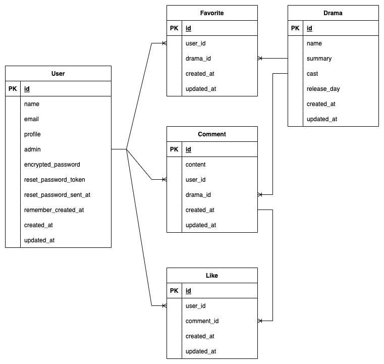

# README

# 目次
# 見出し1
## 見出し2
### 見出し3
#### 見出し4
##### 見出し5

* Ruby version

* System dependencies

* Configuration

* Database creation

* Database initialization

* How to run the test suite

* Services (job queues, cache servers, search engines, etc.)

* Deployment instructions

* ...

