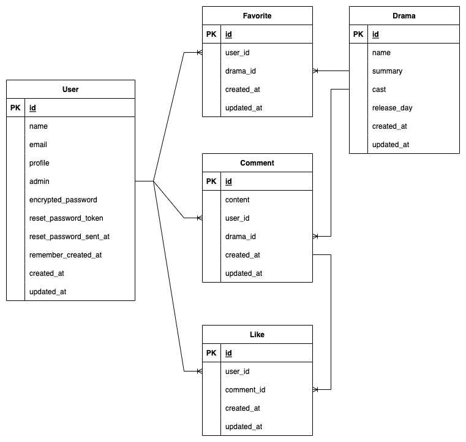

# 韓ドラレビューサイト
#### 韓国ドラマのレビューサイトです。 
* レビューを見るだけであれば、ユーザー登録する必要はありません。
* ユーザー登録することで、ドラマのお気に入り登録、レビュー投稿・更新・いいね登録が使用できるようになります。
* 管理者は既に登録済みです。

👉 [http://35.77.150.207/](http://35.77.150.207/)

# 目次
#### 1. 開発経緯
#### 2. 使用言語
#### 3. システム構成図
#### 4. 機能一覧
#### 5. テスト
#### 6. 使い方
#### 7. こだわりポイント

# 1. 開発経緯
* コロナ禍で人と会ったりするのが難しい世の中なので、色々な人のレビューを見て共感だったり、ドラマを見るきっかけになってもらえたら良いなと思い作成しました。
* 作成者自身、Twitterやポッドキャストでレビューを発信している人を見たり聞いたりすることも多く、ドラマを見終えた後には誰かと共感をしたいのかなと思ったのがきっかけです。
* 作成者が韓国ドラマにハマっていると言うのもありますが、まだまだ韓国ドラマのブームはおさまらないであろうと思い、韓国ドラマ限定のレビューサイトにしました。

# 2. 使用技術
#### フロントエンド
* HTML
* CSS
* javascript

#### バックエンド
* Ruby 2.7.3
* Rails 6.1.4.6
* MySQL 8.0.26

#### インフラ
* AWS　EC2
* Nginx 1.20.0
* Unicorn 5.4.1

#### その他
* git 2.35.1/GitHub
* VSCode

# 3. システム構成図

# 4. 機能一覧
#### 共通
* ユーザー登録
* ログイン・ログアウト
* ドラマ検索

#### 管理者ログイン
* 新規ドラマ登録
* 登録ドラマ編集
* 登録ドラマ削除
* レビュー削除
* ユーザー削除

#### 一般ユーザーログイン
* ドラマお気に入り登録
* レビュー投稿
* レビュー編集
* レビューいいね登録
* マイページ登録

# 5. テスト
* 単体テスト（model）
* 機能テスト(request)
* 結合テスト(feature)

# 6. 使い方
    $ git clone https://github.com/taka70gi/review_app
    $ cd review_app
    $ bundle install
    $ rails db:create
    $ rails db:migrate
    $ rails db:seed
    $ rails s
👉 http://localhost:3000

  あらかじめ以下ユーザーを登録しています。 
* 管理者ユーザー

  メールアドレス:admin@example.jp 
  パスワード：administrator

# 7. こだわりポイント
#### フロントエンド
* 管理者ログイン・一般ユーザーログインではできる機能が異なるので、ナビバーなどはログインユーザーに基づいたものが表示されるようにしました。
* ユーザーアイコンを変更する際に、プレビュー画像が表示されるようにしました。
* いいね登録機能だけでなく、何件いいねが押されているか明示的にわかるようにしました。
* ページ遷移によるユーザーのストレスをなくすため、ドラマお気に入り登録/レビューいいね登録を非同期通信で作成しました。

  以下、ドラマお気に入り登録/レビューいいね登録のイメージです。

https://user-images.githubusercontent.com/92093548/155327099-c103a8a1-ca63-4d01-a47f-b2839f48acee.mov

#### バックエンド
* 管理者権限を持ったユーザーのみ利用できる管理者画面を作成し、主となるドラマの管理の他に、登録ユーザー・投稿レビューの確認、ユーザー・レビューの削除を実装しました。
* Rspecによる統合テストで、不適応な入力があった場合にはエラーとなることもテストしました。

